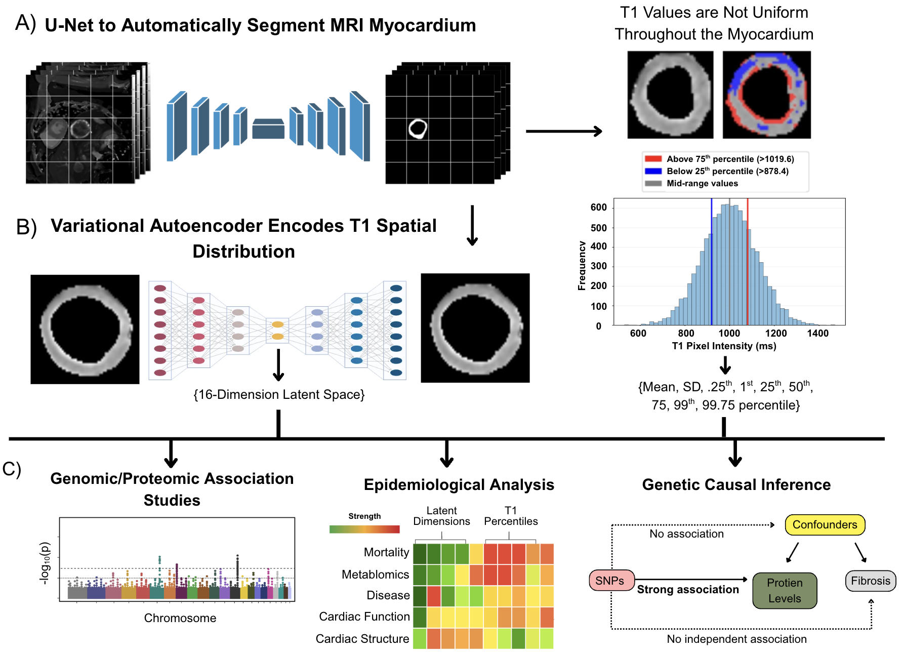

# Deep learning-derived spatial phenotypes and proteome-wide causal inference identify therapeutic targets for cardiac fibrosis

## Overview

Myocardial fibrosis is nearly ubiquitous across major forms of heart disease and is an independent predictor of heart failure, arrhythmia, and sudden cardiac death. No therapy reliably reverses established fibrosis, and diffuse fibrosis is difficult to characterise beyond coarse, scalar summaries of cardiac MRI T1 mapping. Native T1 mapping non-invasively quantifies diffuse myocardial fibrosis, with elevated T1 reflecting collagen deposition and altered tissue composition, but clinical practice typically reports T1 as a single mean value per subject, discarding most of the spatial and distributional information the map contains.

This project uses deep learning to recover that full spatial and distributional structure. In 50,239 UK Biobank participants, nine distributional and 16 spatial T1 phenotypes are extracted from native T1 maps and combined with genome-wide and proteome-wide association studies across circulating proteins, followed by cis-protein quantitative-trait loci (cis-pQTL) Mendelian randomisation, to identify causal mediators of fibrosis and prioritise candidate therapeutic targets.

*Flowchart illustrating the multi-step analytical pipeline developed in this study. (A) U-Net segmentation of myocardial regions of interest from native T1 mapping images. (B) Extraction of conventional scalar metrics alongside spatial heterogeneity analysis through variational autoencoder encoding of myocardial T1 maps into a 16-dimensional latent space. (C) Comprehensive downstream analytical approaches including: (1) genomic and proteomic association studies (GWAS, PWAS, heritability analysis, and rare variant burden testing); (2) clinical relevance analysis for phenotype associations, mortality (Kaplan-Meier survival curves, log-rank tests, Cox models), and disease associations (delta rank analysis, disease prevalence across quartiles); and (3) Mendelian randomisation to establish causal relationships between circulating proteins and myocardial fibrosis phenotypes.*

## Repository structure

This repository contains the original code used by the authors to generate the qualitative results in the manuscript. Each folder is numbered in pipeline order and has its own `README.md` describing every file in it: what it is, what it reads and writes, and the command to run it.

| Folder | Stage |
|---|---|
| [`01_imaging/`](01_imaging/README.md) | DICOM to PNG preprocessing, U-Net myocardium segmentation (training and deployment), mask quality control, SAM fine-tuning. |
| [`02_vae/`](02_vae/README.md) | CVAE training and deployment, latent-dimension extraction, reconstruction-quality evaluation, attention mapping. |
| [`03_phenotypes/`](03_phenotypes/README.md) | Phenotype QC, hematocrit regression, disease-status annotation, sample/ID mapping, and covariate-table preparation. |
| [`04_pwas/`](04_pwas/README.md) | Phenotype/covariate preparation, the per-protein OLS regression that produces the PWAS result tables, and delta-rank disease-association testing. |
| [`05_gwas/`](05_gwas/README.md) | Phenotype residualization/quantile-normalization, PLINK2 GWAS, VCF conversion, liftover, SNP-ID standardization, LDSC heritability/genetic correlation. |
| [`06_mr/`](06_mr/README.md) | cis-pQTL extraction, LD clumping, two-sample Mendelian randomisation, colocalization (`06_mr/colocalization/`), and MR-PRESSO sensitivity analysis (`06_mr/mr_presso/`). |
| [`07_decode_validation/`](07_decode_validation/README.md) | Format conversion for external MR replication in the deCODE Genetics cohort. |
| [`08_clinical_associations/`](08_clinical_associations/README.md) | Cross-phenotype correlation, Kaplan-Meier/Cox survival analysis, and chi-squared disease-prevalence testing. |

Within each folder, files are numbered by execution order, so directory listing order matches run order. Two additional files are kept for reference but left unnumbered, outside the core reproduction sequence: `04_pwas/biomarker_panel_exploratory.ipynb` (an exploratory protein-biomarker machine-learning analysis) and `03_phenotypes/cardiomyopathy_clustering_exploratory.ipynb` (an exploratory K-means clustering analysis).

STRING-db protein-protein interaction analysis, final protein prioritisation, and the deCODE MR-replication comparison were performed using `06_mr/`'s existing scripts against the deCODE-converted inputs, rather than by separate dedicated code.

Not included in this repository: UK Biobank or other participant-level data; genotype files, proteomic measurements, and summary-statistic result sets; scheduler logs; software environments or licensed reference panels. The reported U-Net (`01_imaging/myocardium-unet-256.h5`) and CVAE (`02_vae/cvae_16d_best.weights.h5`) trained weights are included; the alternate CVAE checkpoint (`cvae_16d_optimized.weights.h5`) is kept locally for reference only (git-ignored).

## Demo

[`demo/`](demo/README.md) contains a participant-free demonstration notebook, [`demo/demo_walkthrough.ipynb`](demo/demo_walkthrough.ipynb), that runs every stage of the pipeline end to end (under 90 seconds, no GPU required) on **entirely synthetic data**. It does not reproduce the manuscript's results -- it demonstrates that the code runs correctly and shows what each stage's output represents.

Every stage of the actual research pipeline operates on UK Biobank imaging, genotype, or proteomic data (application 22282). UK Biobank's data-sharing terms prohibit redistributing participant-level data or any subset/derivative of it outside the approved application, which is why the demo above uses synthetic data rather than a small real extract; see "Data availability" below. Researchers with their own approved UK Biobank access (or equivalent institutional access to comparable cardiac MRI/genotype/proteomic data) can instead run the original scripts described above against their own data; each folder's README documents the exact expected input, output, and command for every script, and "Installation guide" below covers configuring the code to point at your own data.

## System requirements

### Operating system
Developed and run on Linux (Stanford Sherlock HPC cluster).

### Software environments
Running the original scripts requires four environments, each pinned in its own file in this repository:
- **Primary environment** ([`requirements.txt`](requirements.txt)): everything except the GPU steps below.
- **GPU environment** ([`requirements-gpu.txt`](requirements-gpu.txt)): the U-Net/SAM steps in `01_imaging/` and the CVAE steps in `02_vae/`. Requires a CUDA 12.4-compatible NVIDIA GPU.
- **CrossMap environment**: hg19-to-hg38 liftover only (`05_gwas/full_hg38_converter_pipline.sh`), via the CrossMap CLI tool.
- **R environment** ([`packages.R`](packages.R)).

A handful of command-line bioinformatics tools (PLINK/PLINK2, LDSC, bcftools, htslib, Ensembl VEP) are also required for the GWAS/MR steps -- see each folder's README for exact versions used.

### Non-standard hardware
A CUDA 12.4-compatible NVIDIA GPU is required for `01_imaging/`'s U-Net/SAM steps and `02_vae/`'s CVAE steps. The remaining stages are CPU-only but can require substantial RAM and multi-day runtimes for large GWAS/MR jobs -- see each folder's `.sh` scripts for exact resource requests.

## Installation guide

### Instructions
1. Clone this repository.
2. Create the primary conda environment and install Python dependencies: `conda create -n fibrosis python=3.9.7 && conda activate fibrosis && pip install -r requirements.txt`.
3. If running the GPU steps (`01_imaging/` U-Net/SAM, `02_vae/` CVAE), create a second environment: `conda create -n fibrosis-gpu python=3.10.15 && conda activate fibrosis-gpu && pip install -r requirements-gpu.txt`. Requires a CUDA 12.4-compatible NVIDIA GPU and driver, installed separately.
4. Install R 4.4 and run `Rscript packages.R` to install the R dependencies.
5. Install the command-line tools (PLINK/PLINK2, LDSC, bcftools, htslib, Ensembl VEP) separately; none are installed by the steps above.
6. To run the original scripts (as opposed to the demo above) against your own UK Biobank data: each script uses a `BASE_DIR` variable (and, where relevant, `LIB_DIR`/`RENV_DIR`/`UKBB_DIR`/`HTSLIB_BIN`) at the top of the file, or relative paths of the form `./data/...` in the notebooks. Set `BASE_DIR` to the root of your data directory, or place/symlink your data under a `data/` directory at the repository root matching each subfolder's relative references.

### Typical install time
Measured directly: `pip install -r requirements.txt` took 32 seconds, and `pip install -r requirements-gpu.txt` took 53 seconds, each into a clean virtual environment on a standard broadband connection. Two caveats on these numbers: they used the latest compatible package versions rather than the exact pins above (Python 3.9.7/3.10.15 were unavailable to test directly), and the GPU install was measured on a CPU-only TensorFlow/PyTorch build -- the Linux CUDA-bundled wheels used on Sherlock pull in several additional multi-hundred-MB `nvidia-*` CUDA library packages and will take meaningfully longer, plausibly several minutes depending on connection speed. Neither number includes NVIDIA driver/CUDA toolkit installation, which is system-dependent. R package installation via `packages.R` was not benchmarked; compiling `coloc`/`MRPRESSO` from source if binaries aren't available can take 10-20 minutes.

## Data availability

This project uses UK Biobank data, available to approved researchers under application 22282; UK Biobank data cannot be redistributed and are not included in this repository. deCODE Genetics proteomics summary statistics used for external replication (`07_decode_validation/`) are available via Eldjarn et al., *Nature* 2023, at https://www.decode.com/summarydata/ (GWAS summary statistics for all 2,931 Olink assays and all 4,907 SomaScan assays).

## Contact

euan@stanford.edu; bgomes@stanford.edu
